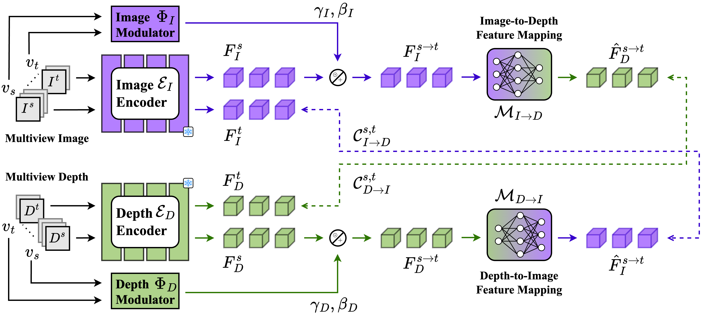

<h1 align="center"> Modulate-and-Map: Crossmodal Feature Mapping with Cross-View Modulation for 3D Anomaly Detection (CVPRF 2026) </h1> 

:rotating_light: This repository contains code snippets and checkpoints of our work "**Modulate-and-Map: Crossmodal Feature Mapping with Cross-View Modulation for 3D Anomaly Detection**" :rotating_light:
 
by [Alex Costanzino](https://alex-costanzino.github.io/)*1, [Pierluigi Zama Ramirez](https://pierlui92.github.io/)*2, [Giuseppe Lisanti](https://www.unibo.it/sitoweb/giuseppe.lisanti)*1, [Luigi di Stefano](https://www.unibo.it/sitoweb/luigi.distefano)*1.

*1 University of Bologna, *2 Ca' Foscari University of Venice


<div class="alert alert-info">


<h2 align="center"> 

[Project Page](https://alex-costanzino.github.io/modmap/) | [Paper (ArXiv)](TBD)
</h2>


## :bookmark_tabs: Table of Contents

1. [Introduction](#clapper-introduction)
2. [Dataset](#file_cabinet)
3. [Checkpoints](#inbox_tray)
4. [Code](#memo-code)
6. [Contacts](#envelope-contacts)

</div>

## :clapper: Introduction

We present ModMap, a natively multiview and multimodal framework for 3D anomaly detection and segmentation. Unlike existing methods that process views independently, our method draws inspiration from the crossmodal feature mapping paradigm to learn to map features across both modalities and views, while explicitly modelling view-dependent relationships through feature-wise modulation.

We introduce a cross-view training strategy that leverages all possible view combinations, enabling effective anomaly scoring through multiview ensembling and aggregation. To process high-resolution 3D data, we train and publicly release a foundational depth encoder tailored to industrial datasets

Experiments on SiM3D, a recent benchmark that introduces the first multiview and multimodal setup for 3D anomaly detection and segmentation, demonstrate that ModMap attains state-of-the-art performance by surpassing previous methods by wide margins. 
<h4 align="center">

</h4>



:fountain_pen: If you find this code useful in your research, please cite:

```bibtex
@article{costanzino2026modmap,
  author    = {Costanzino, Alex and Zama Ramirez, Pierluigi and Lisanti, Giuseppe and Di Stefano, Luigi},
  title     = {Modulate-and-Map: Crossmodal Feature Mapping with Cross-View Modulation for 3D Anomaly Detection},
  journal   = {The IEEE/CVF Conference on Computer Vision and Pattern Recognition Findings},
  year      = {2026},
}
```

<h2 id="file_cabinet"> :file_cabinet: Dataset </h2>

In our experiments, we employed: [SiM3D](https://huggingface.co/datasets/arcanoXIII/SiM3D).


<h2 id="inbox_tray"> :inbox_tray: Checkpoints </h2>

Here, you can download the weights of the networks employed in the results our paper.

To use these weights, please follow these steps:

1. Create a folder named `checkpoints` in the project directory;
2. Download the weights [[Download]](TBD);
3. Copy the downloaded weights into the `checkpoints` folder.


## :memo: Code

<div class="alert alert-info">

**Warning**:
- The code utilizes `wandb` during training to log results. Please be sure to have a wandb account.

</div>

### :hammer_and_wrench: Setup Instructions

**Dependencies**: Ensure that you have installed all the necessary dependencies.

### :rocket: Train and Inference [TBA]

If you haven't downloaded the checkpoints yet, you can find the download links in the **Checkpoints** section above.

## :envelope: Contacts

For questions, please send an email to alex.costanzino@unibo.it.

## Acknowledgment

Part of this work is is derived from [Meta’s DINOv2](https://github.com/facebookresearch/dinov2) and [Meta’s DINOv3](https://github.com/facebookresearch/dinov3), which are licensed under Apache 2.0.